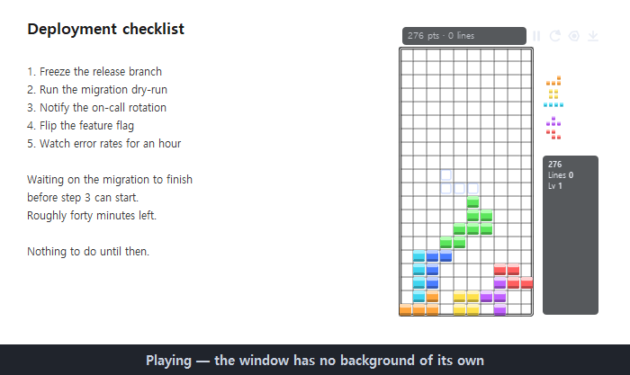
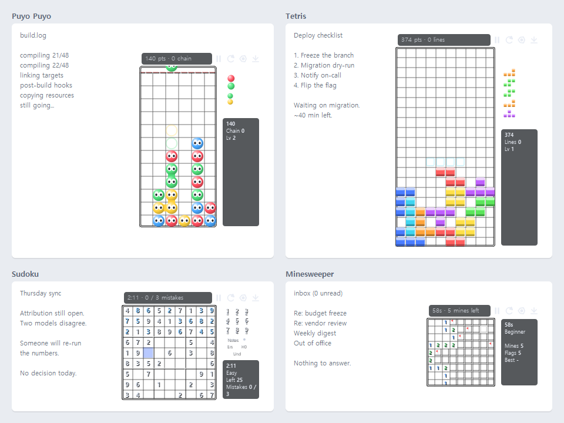

# Stealth Arcade

**Four arcade-faithful puzzle games in one Windows window that disappears the instant you press Esc.**

Puyo Puyo, Tetris, Sudoku and Minesweeper, built on a hiding layer: a global
hotkey that works while another app has focus, a background you can erase until
only the pieces float over whatever is behind them, a disguised window title, and
a tray icon that keeps the game alive while nothing is on screen.

Single file, single dependency (PyQt5). No install, no account, no network.

> 한국어 설명: [README.ko.md](README.ko.md)





*Every shot above is the real app with its background alpha at zero — the boards
are drawn straight over whatever is behind them, and stay readable because the
helper lines adapt to a light backdrop.*

---

## Why this exists

Most "boss key" apps hide a window and stop there. The hiding here is the product:
every rule below exists because a game that vanishes badly is worse than no game.

- **Esc hides instantly and freezes the board.** You never come back to a game
  that topped out while you were away.
- **`Ctrl+Alt+Z` works from any application.** It is registered with the OS, not
  the window, so it fires while you are typing somewhere else.
- **The window can be erased rather than hidden** — set the background alpha to
  zero and the pieces float over the document behind them.
- **It can stay out of the taskbar and Alt+Tab**, and it can wear another name in
  the title bar.
- **Closing the window hides it.** Quitting is a deliberate act (`Ctrl+Alt+Q`).

## Quick start

```bash
pip install PyQt5
```

```bash
python stealth_arcade.py
```

Windows only — the global hotkeys use the Win32 `RegisterHotKey` API.
For a standalone `.exe`, see [Building](#building).

## The games

All four follow their originals rather than a simplified version.

### Puyo Puyo — modern series rules

6×12 field plus a hidden 13th row, topping out on column 3 exactly as the arcade
does. Wall kicks, floor kicks and quick turn. Lock delay that resets on move or
rotate. Arcade scoring — `10 × cleared × (chain + colour + group bonus)` with the
real bonus tables. **All Clear is carried to your next attack**, not paid out on
the spot. Garbage falls up to 30 at a time, offsets against your score, and gets
heavier after margin time starts at 96 s. Pair generation matches the original: a
256-pair sequence, independent uniform draws, and only three colours for the first
three pairs.

### Tetris — guideline / Puyo Puyo Tetris

SRS with the real kick tables, 7-bag, hold, ghost piece, 180° rotation. Lock delay
of 0.5 s with 15 move resets, reset fully when the piece reaches a new low row —
and **soft drop does not lock**, only hard drop does. T-Spin detection by the
3-corner rule. Guideline scoring with back-to-back and combo, and the Puyo Puyo
Tetris garbage table for attack.

### Sudoku — sudoku.com behaviour

Six difficulties. Puzzles are dug from a solved grid with **uniqueness checked at
every step**, then graded by *actually solving them with human techniques* —
singles, locked candidates, subsets, X-Wing/Swordfish/Jellyfish, XY-Wing,
XYZ-Wing, colouring, unique rectangles, and forcing chains. No puzzle ships that
the solver cannot crack by logic, so you are never asked to guess.

| Difficulty | Givens | Techniques needed |
|---|---|---|
| Easy | 40–45 | singles |
| Medium | 34–38 | singles |
| Hard | 30–33 | up to subsets |
| Expert | 27–30 | up to XY-Wing |
| Master | 25–28 | fish and wings |
| Extreme | 22–26 | **forcing chains required** |

Notes mode is a toggle switch, and the whole board shifts colour while it is on.
Mistake limit is configurable (1 / 3 / 5 / none). An unfinished puzzle is kept, so
you pick up where you left off after restarting the app.

### Minesweeper — the original

Beginner 9×9/10, Intermediate 16×16/40, Expert 30×16/99. Left click reveals, right
click cycles flag → question mark → clear, and both buttons (or the middle button)
clear around a number. Flags block a reveal, question marks do not. Chording only
opens when the flag count matches — and if a flag is wrong, it blows up. The first
cell is never a mine, using winmine's actual method: mines are placed up front and
the one you clicked is *moved* to the first free cell. Wrong flags get an X when
you lose.

## Controls

Every key is rebindable in Settings → Keys, which only lists the actions the
current game uses.

```
Esc              hide instantly
P                pause  (or the ‖ button; click the board to resume)
R / F2           restart now, no confirmation
F1               settings
Ctrl+R           menu (right-click the window works too)
Ctrl+B           erase background
Ctrl+G           grid lines on/off
Ctrl+wheel       opacity
Ctrl+= / Ctrl+-  window size  (Ctrl+Up / Ctrl+Down also work)
Alt+drag         move the window from anywhere, including the board
drag an edge     resize — the window snaps to whole cells as you drag
```

Global — these work while another application has focus:

```
Ctrl+Alt+Z       hide / bring back
Ctrl+Alt+F2      restart
Ctrl+Alt+B       erase background
Ctrl+Alt+P       pause
Ctrl+Alt+←→↓↑    move / soft drop / rotate
Ctrl+Alt+Enter   hard drop
Ctrl+Alt+H       hold
Ctrl+Alt+Q       quit
```

Per game:

```
Puyo / Tetris    ←→ move · ↓ soft drop · ↑ or X rotate · Z counter-rotate
                 Space hard drop · C hold · A 180°
Sudoku           1-9 enter · arrows move · N notes · Delete erase
                 Ctrl+Z undo · H hint
Minesweeper      left reveal · right flag · both/middle clear around
                 arrows move · Space reveal · F flag · D clear around
```

The same key does different jobs per game — `↓` is soft drop in the falling
puzzles and moves the cursor in Sudoku — because only the current game's actions
are bound.

## Staying readable when the background is gone

Turn the background down and the window behind shows through. Drop it on a white
document and white grid lines vanish completely. Colour alone cannot fix this: what
reads on a dark backdrop is the opposite of what reads on a light one.

So anything light gets a dark layer underneath — grid lines are drawn twice with a
one-pixel offset, boards get a dark-then-light double border, and panel text sits
on a dark plate. It scales with how transparent you made the background and does
nothing at all when you left it opaque.

Measured on a white document with the background fully erased: grid line contrast
went from 1.00 (literally invisible) to 5.49, and panel text from 1.18 to 5.95. If
you prefer the plainer look, one checkbox turns all of it off — and off is
pixel-identical to the version before it existed.

## Building

```bash
build.bat
```

Produces `dist\Notepad.exe` — one file, no console, ~24 MB. The script kills a
running copy first (matched by path, so your real Notepad is safe), then builds
from `Notepad.spec`, which drops the Qt modules this app never loads.

Always build from the spec. Handing `stealth_arcade.py` to PyInstaller directly makes
it overwrite `Notepad.spec` and the exe goes back to 40 MB.

## How it is put together

One file, split into a window/stealth layer that never changes and games that plug
into it:

| Layer | What it does |
|---|---|
| `HotkeyFilter`, `Hotkeys` | `RegisterHotKey` + `WM_HOTKEY` through a native event filter |
| `Config` | settings / per-game options / records / saves, written atomically |
| `PuyoWindow` | frameless translucent window, tray, dragging, keymap, tick loop |
| `GameSpec` | one registration record per game |
| `*Game` | rules only, no Qt |
| `*Board`, side panels | drawing and mouse |

Adding a game means writing a rules class, a board widget, a stats function and a
settings tab, then calling `register_game(GameSpec(...))`. The window, hiding,
hotkeys, config, records, translations and the visibility helpers all come for
free. Minesweeper was added this way.

The UI ships in English and Korean (Settings → Screen → Language), switchable
without a restart. Untranslated strings are collected at runtime so a missing one
can be found by sweeping the games rather than by reading the source.

Settings live in `%APPDATA%\StealthPuyo\config.json`.

## License

MIT — see [LICENSE](LICENSE). The MIT grant covers this implementation's own
source code; it does not grant any rights in the trademarks named below.

## Trademarks

Puyo Puyo and Tetris are trademarks of SEGA and The Tetris Company respectively.
This is an independent reimplementation of their published rules, not affiliated
with or endorsed by either.
